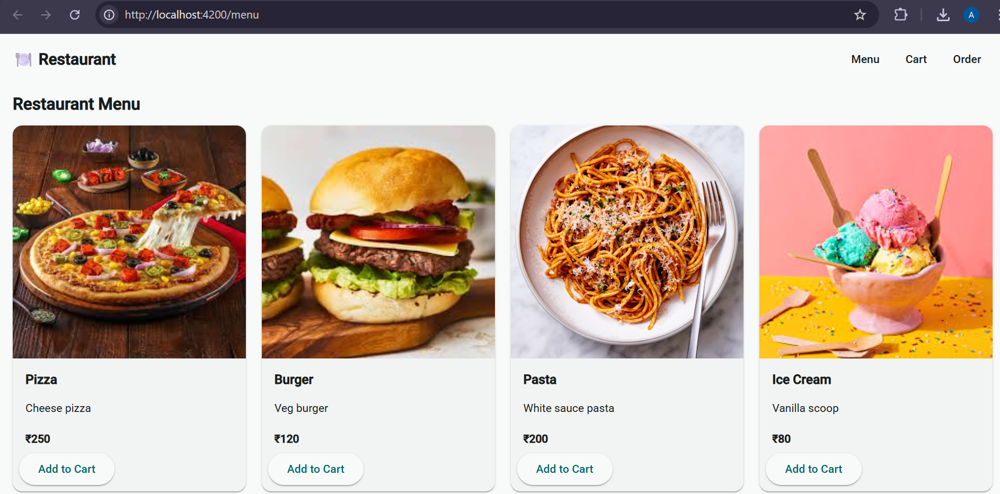
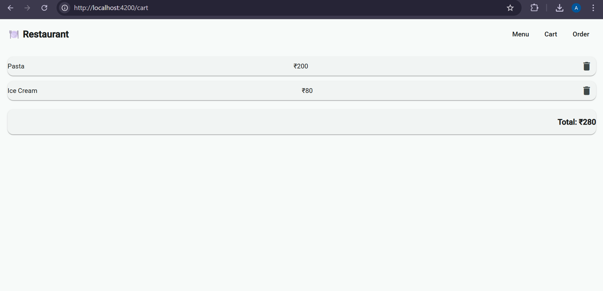
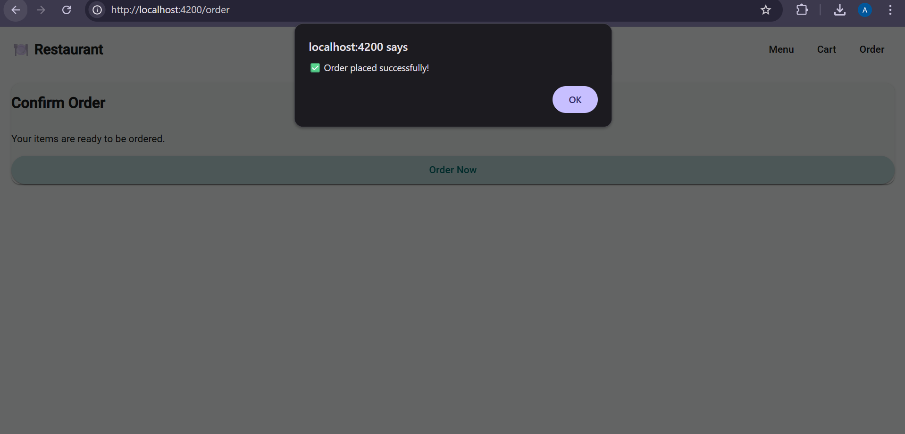

# Restaurant Menu & Ordering System

A **Restaurant Menu and Ordering System** built using **Angular 20**, **TypeScript**, and **Angular Material**.
This application allows users to browse menu items, add items to a cart, delete cart items, and place an order.

---

### Menu Page

### Cart Page

### Order Page



## Project Objective

To build a real-world, data-driven Angular application that demonstrates:

* Angular standalone components
* Routing and navigation
* Services and dependency injection
* Angular Material UI components
* Basic state management using services


## Tech Stack

* **Framework:** Angular 20 (Standalone + Vite)
* **Language:** TypeScript
* **UI Library:** Angular Material
* **Styling:** CSS
* **State Management:** Angular Services
* **Assets:** Static images

---

## How to Run the Project

```bash
npm install
ng serve
```

Then open:

```
http://localhost:4200
```


---
